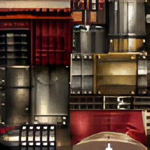

# mhfu-sharpen-texture
extracted texture sharpen for mhfu


# Caution
This is **NOT** HD Textures!

This is just a generator to sharpen the raw textures.


# Requirements
- Android OS
- PPSSPP app to play the game
- Termux app with ```git``` and ```php``` installed in in it


# Usage
- Open Termux app, and install ```git``` and ```php``` if they're not installed yet
  ```
  pkg install git php
  ```
- Clone the repo to psp directory using ```git```
  ```
  cd /sdcard/psp
  git clone https://github.com/9r3i/mhfu-sharpen-texture
  cd mhfu-sharpen-texture
  ```
- Generate the sharpening from the raw materials using ```php```
  ```
  php sharpen.php
  ```
- Its gonna take awhile, just wait until its done
- Move the generated of the sharpened textures to psp textures directory
  ```
  mv -v ULUS10391 /sdcard/psp/textures
  ```
- Done! Now turn on the texture replacement on the settings of PPSSPP app:
  - Open PPSSPP app
  - Go for settings --> tools --> developer tools --> replace textures --> check it
  - Play the game and enjoy! 


# Sample

- Before
  - 
- After
  - 


# Closing
That's all there is to it. Alhamdulillaah...


